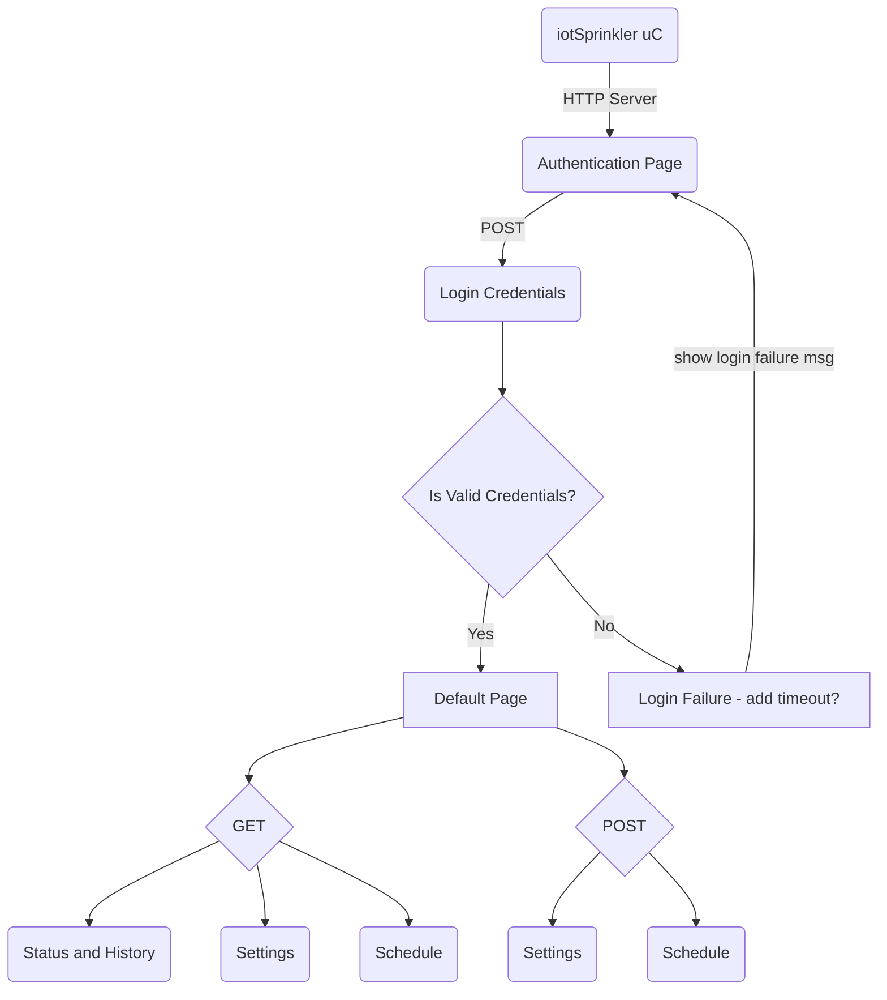

## iotSprinkler

Summary: Microcontroller based sprinkler controller with HTTP server interface.

Hardware: Planning on using the Nordic nrf52840 (has built in WiFi and bluetooth capability)

Top Level Flowchart on planned pages (starting simple)

