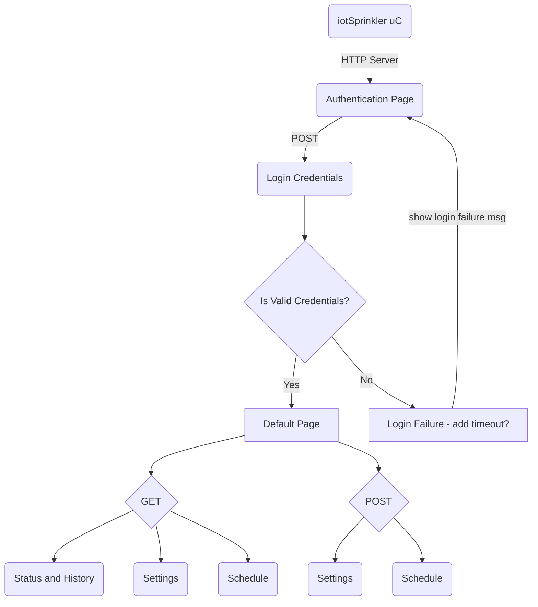

## iotSprinkler

Summary: Microcontroller based sprinkler controller with HTTP server interface. Will allow single user connection on local network to device. Change irragation schedule or manually control watering. Smart watering mode will utilize weather data to automatically determine optimum watering amount. SD card for storing user preferences and logging basic system and weather data. 

Hardware: Planning on using the Nordic nrf52840 (has built in WiFi and bluetooth capability)

Top Level Flowchart on planned pages (starting simple):

Will look at using MicroPython for software. Will look into hardware limitations.
https://github.com/micropython/micropython/tree/master/ports/nrf/boards/nrf52840-mdk-usb-dongle
